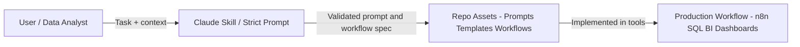

# Strict-Mode AI Prompt & Automation Playbook for Modern Data Teams

[](LICENSE)
[](https://www.markdownguide.org/)
[](./README.md#-contribution-guidelines)
[](./claude_skills/)

> A strict-mode operating system for AI-assisted analytics, data engineering, and enterprise AI delivery in 2026.
> Everything here is designed for teams that need outputs to be **auditable, testable, and safe to deploy**.

Production-ready AI documentation for analytics, BI, data engineering, and enterprise AI architecture.

---

## For Hiring Managers

This project is designed to be read as a portfolio piece.

- **Architecture thinking** – I treat AI models as components in a data stack (alongside SQL, Python, n8n, BI), with clear interfaces and failure modes.
- **Production mindset** – Prompts, Claude Skills, and workflows are written in "strict mode" so they can be reused, versioned, and audited instead of living in random chats.
- **Multi-model fluency** – I work across Claude, ChatGPT, and Gemini, picking the right model for analysis, coding, or research, and documenting how a data team can use each safely.
- **Agentic systems** – Four brand-new agentic Claude Skills implement autonomous, self-directed workflows with safety gates, closed-loop remediation, and continuous learning.

---

## ✨ What This Repo Gives You

- **25 Claude Skills** — fully compliant with Anthropic's official Skill specification (YAML frontmatter, kebab-case folders, trigger phrases, zero XML).
- **4 Agentic Skills** — autonomous, self-healing workflows for data quality, incident response, query optimization, and ML feature engineering.
- Model-specific workflows that match real strengths of Claude, ChatGPT, and Gemini.
- Enterprise-grade blueprints for architecture, reliability, governance, privacy, and cost control.
- n8n workflows updated for **n8n v1.x** with correct node types and Code node syntax.
- Built-in anti-hallucination controls across all major files.

---

## 📖 Claude Skill Standard

All 25 Claude Skills in this repo were built and audited against **Anthropic's official guide:  
"The Complete Guide to Building Skills for Claude"** (included as `The-Complete-Guide-to-Building-Skill-for-Claude.pdf`).

Every skill follows the full specification:

| Requirement | Implementation |
|---|---|
| File naming | Exactly `SKILL.md` (case-sensitive) |
| Folder naming | `kebab-case` — no underscores, no capitals, no spaces |
| YAML frontmatter | `---` delimited with `name` + `description` fields |
| Trigger phrases | Every `description` includes "Use when user says..." with specific phrases |
| No XML tags | All `<role>`, `<instructions>`, `<output_format>` tags replaced with Markdown |
| Structured instructions | Numbered steps, examples, troubleshooting, edge cases |

> **To use a skill:** Upload the skill folder (e.g. `claude_skills/n8n-workflow-architect/`) to Claude.ai via Settings → Capabilities → Skills, or place it in your Claude Code skills directory.

---

## How the Strict-Mode Flow Works

This is how a data team would actually use this repo in practice, from a human asking for help to a productionized workflow.



---

## 🗂️ Repository Structure

| Folder | Contents | What You Can Do |
|---|---|---|
| `prompts/` | 1 mega library (40 strict-mode prompts) | Run advanced analytics/BI/ML/automation prompting playbooks |
| `claude_skills/` | **25 skills** (20 domain + 4 agentic + 1 reference) | Drop into Claude.ai or Claude Code for instant expert workflows |
| `custom_gpts/` | 19 GPT designs | Build specialized assistants with enterprise guardrails |
| `gemini_gems/` | 19 Gem designs | Build source-grounded synthesis assistants for strategy/governance |
| `tutorials/` | 6 deep tutorials | Execute complete projects from notebook builds to real-time systems |

<details>
<summary><strong>▶ Expand Full File Tree</strong></summary>

```text
.
├── README.md
├── LICENSE
├── The-Complete-Guide-to-Building-Skill-for-Claude.pdf
├── prompts/
│   └── mega_prompt_library.md
├── tutorials/
│   ├── ai_portfolio_github_readme_one_evening.md
│   ├── building_native_text_to_sql_agent_over_semantic_layer.md
│   ├── end_to_end_modern_data_stack_setup_weekend.md
│   ├── fraud_detection_analytics_notebook_45_minutes.md
│   ├── migrating_from_batch_to_real_time_flink_kafka_starter_guide.md
│   └── n8n_personal_analytics_command_center.md          ← updated for n8n v1.x
├── claude_skills/
│   │
│   ├── ── AGENTIC SKILLS (self-directed, autonomous loops) ──
│   ├── autonomous-data-quality-sentinel/SKILL.md          🆕 Agentic
│   ├── intelligent-incident-responder/SKILL.md            🆕 Agentic
│   ├── self-optimizing-query-performance-agent/SKILL.md   🆕 Agentic
│   ├── adaptive-ml-feature-store-agent/SKILL.md           🆕 Agentic
│   │
│   ├── ── DOMAIN SKILLS (expert workflows) ──
│   ├── ab-test-design-evaluation-specialist/SKILL.md
│   ├── bi-dashboard-architect/SKILL.md
│   ├── causal-inference-econometrics-coach/SKILL.md
│   ├── data-lakehouse-architect/SKILL.md
│   ├── data-mesh-domain-modeler/SKILL.md
│   ├── data-privacy-gdpr-redaction-reviewer/SKILL.md
│   ├── data-warehouse-migration-architect/SKILL.md
│   ├── dbt-analytics-engineer-mentor/SKILL.md
│   ├── differential-privacy-synthetic-data-generator/SKILL.md
│   ├── eda-sql-coach/SKILL.md
│   ├── event-driven-orchestration-architect/SKILL.md
│   ├── identity-resolution-entity-matching-architect/SKILL.md
│   ├── job-search-analyst/SKILL.md
│   ├── n8n-workflow-architect/SKILL.md
│   ├── portfolio-readme-editor/SKILL.md
│   ├── python-data-viz-storytelling-coach/SKILL.md
│   ├── rag-pipeline-evaluator-llm-as-judge/SKILL.md
│   ├── reverse-etl-data-activation-strategist/SKILL.md
│   ├── semantic-layer-modeler/SKILL.md
│   ├── terraform-iac-builder-data-platforms/SKILL.md
│   └── unstructured-data-pipeline-designer/SKILL.md
├── custom_gpts/
│   ├── ada_spatial_mapper_gpt.md
│   ├── airflow_dagster_dynamic_dag_generator_gpt.md
│   ├── alert_fatigue_data_observability_tuner_gpt.md
│   ├── anomaly_detection_time_series_debugger_gpt.md
│   ├── bayesian_experimentation_simulator_gpt.md
│   ├── bi_dashboard_coach_gpt.md
│   ├── cicd_pipeline_builder_data_teams_gpt.md
│   ├── cloud_data_finops_copilot_gpt.md
│   ├── data_quality_governance_copilot_gpt.md
│   ├── fraud_analytics_copilot_gpt.md
│   ├── graph_analytics_network_flow_debugger_gpt.md
│   ├── kafka_streaming_analytics_debugger_gpt.md
│   ├── llm_fine_tuning_dataset_curator_gpt.md
│   ├── mlops_deployment_copilot_gpt.md
│   ├── portfolio_job_application_assistant_gpt.md
│   ├── pyspark_big_data_refactoring_copilot_gpt.md
│   ├── semantic_cache_optimizer_gpt.md
│   ├── soc2_hipaa_automated_data_auditor_gpt.md
│   └── sql_performance_cost_optimizer_gpt.md
└── gemini_gems/
    ├── ai_roi_finops_forecaster_gem.md
    ├── analytics_research_gem.md
    ├── analytics_roi_calculator_gem.md
    ├── automated_data_catalog_documenter_gem.md
    ├── automation_planner_gem.md
    ├── board_level_data_storyteller_gem.md
    ├── cross_functional_metric_tiebreaker_gem.md
    ├── data_catalog_lineage_sync_dataplex_gem.md
    ├── data_lineage_compliance_mapper_gem.md
    ├── drive_to_dashboard_spec_generator_gem.md
    ├── enterprise_data_contract_negotiator_gem.md
    ├── executive_data_strategy_to_roadmap_converter_gem.md
    ├── incident_postmortem_trend_synthesizer_gem.md
    ├── meeting_transcript_to_data_ticket_converter_gem.md
    ├── mna_data_integration_strategist_gem.md
    ├── sql_bigquery_review_gem.md
    ├── stakeholder_okr_to_analytics_kpi_translator_gem.md
    ├── vendor_api_contract_analyzer_gem.md
    └── vendor_evaluation_rfp_analyzer_gem.md
```

</details>

---

## 🤖 Claude Skills Reference (25 Total)

### ⚡ Agentic Skills — Autonomous Self-Directed Workflows

These skills operate as autonomous agents: they run multi-step diagnostic and remediation loops, make decisions with safety gates, and self-heal without constant human prompting.

| Skill | What It Does Autonomously |
|---|---|
| `autonomous-data-quality-sentinel` | Profiles tables, detects anomalies (z-score/PSI/KL), diagnoses root causes, auto-remediates safe issues, escalates P1/P2 |
| `intelligent-incident-responder` | Triages pipeline failures by severity (SEV-1–4), correlates symptoms across systems, executes runbooks, generates post-mortems |
| `self-optimizing-query-performance-agent` | Discovers expensive queries, analyzes execution plans, applies verified rewrites, tracks savings, auto-rolls back on regression |
| `adaptive-ml-feature-store-agent` | Discovers features from raw data, validates statistically (SHAP/MI), deploys pipelines, monitors drift (PSI), self-heals |

### 🏗️ Domain Skills — Expert Workflow Templates

| Skill | Use When You Need To |
|---|---|
| `ab-test-design-evaluation-specialist` | Design or evaluate A/B experiments with power analysis and guardrails |
| `bi-dashboard-architect` | Design decision-oriented dashboards with KPI contracts and drill paths |
| `causal-inference-econometrics-coach` | Design DiD, SCM, or IV studies for executive ROI decisions |
| `data-lakehouse-architect` | Design Iceberg/Delta architectures with compaction and partition strategies |
| `data-mesh-domain-modeler` | Define data products, contracts, and federated governance |
| `data-privacy-gdpr-redaction-reviewer` | Audit PII exposure and design masking/RBAC controls |
| `data-warehouse-migration-architect` | Migrate legacy SQL to Snowflake/BigQuery with parity validation |
| `dbt-analytics-engineer-mentor` | Refactor SQL into dbt models with tests and macros |
| `differential-privacy-synthetic-data-generator` | Design DP-safe synthetic datasets with utility validation |
| `eda-sql-coach` | Convert analytics questions into validated SQL and EDA plans |
| `event-driven-orchestration-architect` | Replace cron DAGs with Kafka/EventBridge triggered pipelines |
| `identity-resolution-entity-matching-architect` | Build Customer 360 / Golden Record probabilistic matching pipelines |
| `job-search-analyst` | Build evidence-based application strategies for analytics roles |
| `n8n-workflow-architect` | Design production n8n workflows with retry, approval, and error handling |
| `portfolio-readme-editor` | Convert project outputs into recruiter-ready narratives |
| `python-data-viz-storytelling-coach` | Build executive-ready chart narratives with Seaborn/Plotly |
| `rag-pipeline-evaluator-llm-as-judge` | Design RAG evaluation rubrics and hallucination-rate gates |
| `reverse-etl-data-activation-strategist` | Design idempotent warehouse-to-CRM syncs with quota controls |
| `semantic-layer-modeler` | Model MetricFlow/Cube definitions with governance and caching |
| `terraform-iac-builder-data-platforms` | Generate least-privilege Terraform for Snowflake/BigQuery/dbt Cloud |
| `unstructured-data-pipeline-designer` | Design Cortex/Mosaic extraction pipelines from text at scale |

---

## 🧠 Core Philosophy (Strict Mode)

| Model | Best Role | How This Repo Uses It |
|---|---|---|
| **Claude** | Architecture, system design, agentic workflows | Skill-driven, step-by-step, structured Markdown instructions |
| **ChatGPT (o1/o3 + GPT-4o)** | Reasoning + code execution | Two-phase flow: reason with o1/o3, execute/code with GPT-4o |
| **Gemini** | Source-grounded synthesis | Multi-doc grounding with explicit source mapping and conflict handling |

---

## 📦 Expansion Packs Included

### Staff-Level Expansion
- Lakehouse architecture (Iceberg/Delta), causal inference, Terraform IaC, RAG evaluation, reverse ETL, data mesh.
- FinOps, dynamic orchestration, PySpark refactoring, Bayesian simulation, anomaly debugging, SOC2/HIPAA checks.
- Real-time migration guide (batch dbt → Kafka/Flink).

### Principal-Level / Enterprise AI Expansion
- Identity resolution and entity matching (Golden Record / Customer 360).
- Differential privacy and synthetic data strategy.
- Unstructured data pipelines via warehouse-native AI (Cortex/Mosaic).
- Event-driven orchestration beyond cron DAGs.
- Native Text-to-SQL agent tutorial over a semantic layer (anti-hallucination by design).

### Agentic Expansion (New)
- Autonomous data quality monitoring with self-healing pipelines.
- Intelligent incident response with severity triage and auto post-mortems.
- Self-optimizing query performance with verified closed-loop rewrites.
- Adaptive ML feature store with drift detection and automatic remediation.

<details>
<summary><strong>▶ Staff-Level Expansion Files</strong></summary>

### Claude Skills (Staff)
- `claude_skills/data-lakehouse-architect/SKILL.md`
- `claude_skills/causal-inference-econometrics-coach/SKILL.md`
- `claude_skills/terraform-iac-builder-data-platforms/SKILL.md`
- `claude_skills/rag-pipeline-evaluator-llm-as-judge/SKILL.md`
- `claude_skills/reverse-etl-data-activation-strategist/SKILL.md`
- `claude_skills/data-mesh-domain-modeler/SKILL.md`

### Custom GPTs (Staff)
- `custom_gpts/cloud_data_finops_copilot_gpt.md`
- `custom_gpts/airflow_dagster_dynamic_dag_generator_gpt.md`
- `custom_gpts/pyspark_big_data_refactoring_copilot_gpt.md`
- `custom_gpts/bayesian_experimentation_simulator_gpt.md`
- `custom_gpts/anomaly_detection_time_series_debugger_gpt.md`
- `custom_gpts/soc2_hipaa_automated_data_auditor_gpt.md`

### Gemini Gems (Staff)
- `gemini_gems/executive_data_strategy_to_roadmap_converter_gem.md`
- `gemini_gems/data_catalog_lineage_sync_dataplex_gem.md`
- `gemini_gems/vendor_api_contract_analyzer_gem.md`
- `gemini_gems/incident_postmortem_trend_synthesizer_gem.md`
- `gemini_gems/analytics_roi_calculator_gem.md`
- `gemini_gems/cross_functional_metric_tiebreaker_gem.md`

### Tutorial (Staff)
- `tutorials/migrating_from_batch_to_real_time_flink_kafka_starter_guide.md`

</details>

<details>
<summary><strong>▶ Principal-Level Expansion Files</strong></summary>

### Claude Skills (Principal)
- `claude_skills/identity-resolution-entity-matching-architect/SKILL.md`
- `claude_skills/differential-privacy-synthetic-data-generator/SKILL.md`
- `claude_skills/unstructured-data-pipeline-designer/SKILL.md`
- `claude_skills/event-driven-orchestration-architect/SKILL.md`

### Custom GPTs (Principal)
- `custom_gpts/llm_fine_tuning_dataset_curator_gpt.md`
- `custom_gpts/alert_fatigue_data_observability_tuner_gpt.md`
- `custom_gpts/graph_analytics_network_flow_debugger_gpt.md`
- `custom_gpts/semantic_cache_optimizer_gpt.md`

### Gemini Gems (Principal)
- `gemini_gems/mna_data_integration_strategist_gem.md`
- `gemini_gems/enterprise_data_contract_negotiator_gem.md`
- `gemini_gems/ai_roi_finops_forecaster_gem.md`
- `gemini_gems/board_level_data_storyteller_gem.md`

### Tutorial (Principal)
- `tutorials/building_native_text_to_sql_agent_over_semantic_layer.md`

</details>

<details>
<summary><strong>▶ Agentic Expansion Files (New)</strong></summary>

### Claude Skills (Agentic)
- `claude_skills/autonomous-data-quality-sentinel/SKILL.md`
- `claude_skills/intelligent-incident-responder/SKILL.md`
- `claude_skills/self-optimizing-query-performance-agent/SKILL.md`
- `claude_skills/adaptive-ml-feature-store-agent/SKILL.md`

</details>

---

## 🧭 Fast Navigation

### Start Here: Data / BI Builders
- `prompts/mega_prompt_library.md`
- `claude_skills/eda-sql-coach/SKILL.md`
- `tutorials/fraud_detection_analytics_notebook_45_minutes.md`

### Start Here: Analytics Engineering / Platform
- `claude_skills/dbt-analytics-engineer-mentor/SKILL.md`
- `claude_skills/terraform-iac-builder-data-platforms/SKILL.md`
- `custom_gpts/airflow_dagster_dynamic_dag_generator_gpt.md`
- `tutorials/end_to_end_modern_data_stack_setup_weekend.md`

### Start Here: Principal / Enterprise Architecture
- `claude_skills/identity-resolution-entity-matching-architect/SKILL.md`
- `claude_skills/differential-privacy-synthetic-data-generator/SKILL.md`
- `claude_skills/unstructured-data-pipeline-designer/SKILL.md`
- `claude_skills/event-driven-orchestration-architect/SKILL.md`
- `gemini_gems/mna_data_integration_strategist_gem.md`
- `gemini_gems/enterprise_data_contract_negotiator_gem.md`

### Start Here: Agentic / Autonomous Systems
- `claude_skills/autonomous-data-quality-sentinel/SKILL.md`
- `claude_skills/intelligent-incident-responder/SKILL.md`
- `claude_skills/self-optimizing-query-performance-agent/SKILL.md`
- `claude_skills/adaptive-ml-feature-store-agent/SKILL.md`

### Start Here: Enterprise AI + Semantic Reliability
- `custom_gpts/llm_fine_tuning_dataset_curator_gpt.md`
- `custom_gpts/semantic_cache_optimizer_gpt.md`
- `claude_skills/rag-pipeline-evaluator-llm-as-judge/SKILL.md`
- `tutorials/building_native_text_to_sql_agent_over_semantic_layer.md`

---

## 🏗️ What You Can Build with This Repo

- KPI systems with semantic consistency and explicit governance contracts.
- Lakehouse and warehouse architectures with performance and cost controls.
- Event-driven data platforms with replay-safe idempotency patterns.
- RAG and GenAI systems with measurable retrieval/hallucination quality gates.
- Privacy-preserving synthetic datasets with formal DP-aware release controls.
- Data contract operating models between software and analytics teams.
- Executive and board-ready strategy narratives grounded in data evidence.
- **Autonomous, self-healing data pipelines with structured escalation and post-incident learning.**

---

## ✅ Recommended Execution Workflow

1. Define objective, decision owner, and risk tier.
2. Select asset type:
   - **Claude Skill** — for architecture, operating controls, and agentic workflows.
   - **Custom GPT** — for implementation acceleration and simulation.
   - **Gemini Gem** — for multi-doc synthesis and policy reconciliation.
3. Run strict-mode checks every time:
   - assumptions
   - edge cases
   - validation tests
   - confidence levels
4. Use each file's **Troubleshooting** section before production rollout.
5. Log prompt, input snapshot, output decision, and follow-up changes.

---

## 🚀 Quick Start

```bash
git clone https://github.com/daniel-st3/ai-analytics-prompt-playbook.git
cd ai-analytics-prompt-playbook
code .
```

---

## 🔁 Team Usage Pattern (Weekly)

1. Pick one high-impact business/system problem.
2. Use one primary Skill + one GPT/Gem companion.
3. Execute with strict validation and red-team prompts.
4. Capture lessons in runbook/docs.
5. Promote reusable patterns back into this repo.

---

## 🤝 Contribution Guidelines

1. Keep additions original, practical, and high-rigor.
2. New Claude Skills **must** follow the spec: `kebab-case/SKILL.md`, YAML frontmatter, trigger phrases, no XML tags.
3. Include troubleshooting/hallucination controls in every major new file.
4. Prefer focused PRs with explicit before/after value and validation evidence.

---

## 📜 License

This project is licensed under the **MIT License** — see the `LICENSE` file for details. Free to use, copy, and adapt for your own workflows.
